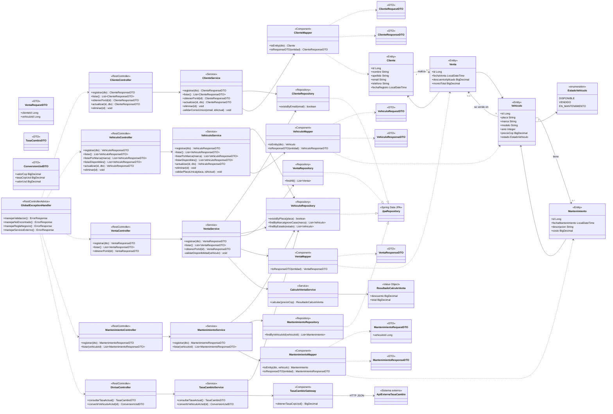

# Diagrama de clases de implementacion

**Proyecto:** AutoDrive Motors JAO
**Fecha:** 2026-10-06
**Alcance:** diseno de la aplicacion Spring Boot por capas; complementa el diagrama de dominio existente.
**Estado:** propuesta de implementacion. Este repositorio aun no contiene codigo Java ejecutable.

El diagrama expone la capa REST solicitada en el taller y mantiene las responsabilidades separadas: los controladores reciben y devuelven DTOs JSON, los servicios concentran reglas de negocio y transacciones, y los repositorios JPA representan el acceso DAO a la base de datos.

## Contrato REST representado

| Recurso | Operaciones principales |
| --- | --- |
| `ClienteController` | `GET/POST /clientes`, `GET/PUT/DELETE /clientes/{id}` |
| `VehiculoController` | `GET/POST /vehiculos`, `GET/PUT/DELETE /vehiculos/{id}`, `GET /vehiculos/disponibles`, `GET /vehiculos/marca/{marca}` |
| `VentaController` | `POST /ventas`, `GET /ventas`, `GET /ventas/{id}` |
| `MantenimientoController` | `POST /mantenimientos`, `GET /mantenimientos` y filtro opcional por `vehiculoId` |
| `DivisaController` | endpoints de consulta de tasa y conversion a USD, adicionales a los minimos del taller |

## Reglas reflejadas

- `VentaService.registrar` y `MantenimientoService.registrar` son transaccionales: el registro y el cambio de estado deben confirmarse o revertirse juntos.
- `CalculoVentaService` aplica 5 % solo cuando `precioCop > 100.000.000`; importes y tasas usan `BigDecimal`.
- `VentaService` solo acepta vehiculos `DISPONIBLE`; `ClienteService` y `VehiculoService` verifican unicidad de correo y placa respectivamente.
- `TasaCambioGateway` encapsula la dependencia HTTP externa. Un fallo se propaga como error controlado hacia `GlobalExceptionHandler`, sin detener los demas recursos.

## Trazabilidad

Este diseno cubre RF-01 a RF-25 y RNF-03, RNF-05 a RNF-19, RNF-22 a RNF-25. Las secuencias de los flujos transaccionales y de integracion externa estan en [Diagramas_de_secuencia.md](../08_Diagramas_de_secuencia/Diagramas_de_secuencia.md).
