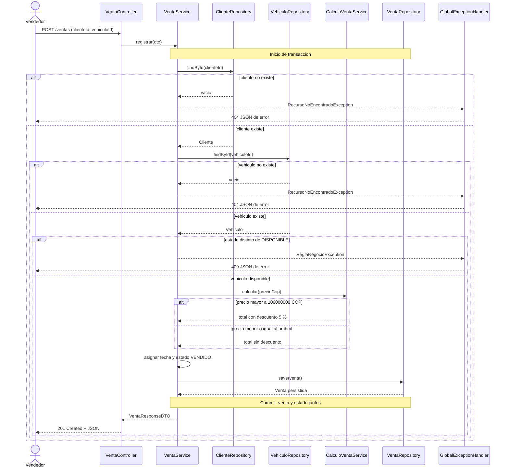
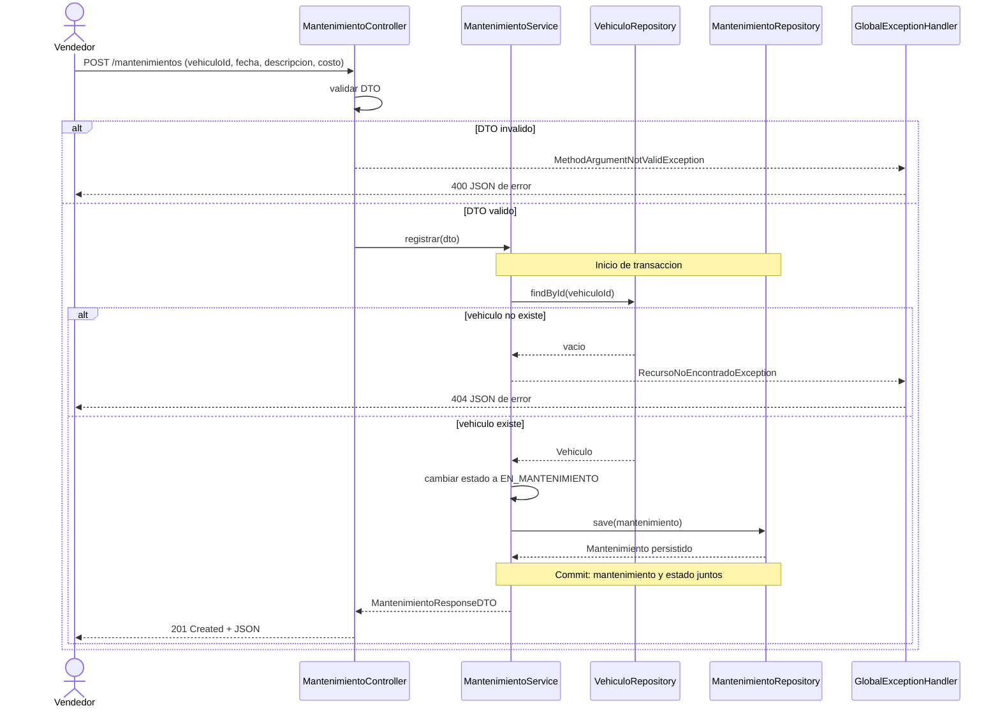
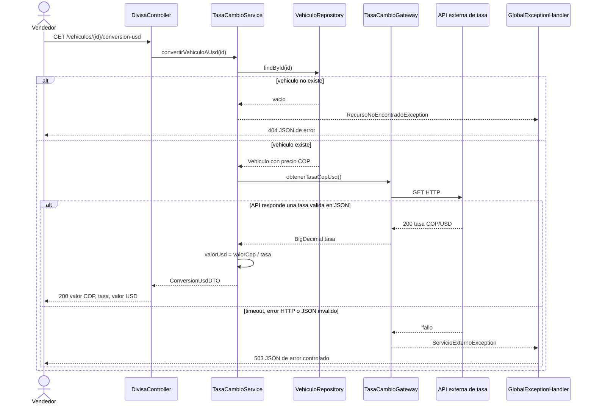

# Diagramas de secuencia

**Proyecto:** AutoDrive Motors JAO
**Fecha:** 2026-10-06
**Estado:** diseno basado en RF, RNF, historias de usuario y narrativas de casos de uso. No representa ejecucion de codigo aun inexistente en el repositorio.

Los tres flujos cubren las operaciones con reglas de negocio, atomicidad o integracion externa que requieren mayor evidencia de comportamiento.

## 1. Registrar venta - CU-12

**Trazabilidad:** RF-12 a RF-18, HU-12 a HU-18 y RNF-18 a RNF-19.

## 2. Registrar mantenimiento - CU-21

**Trazabilidad:** RF-21 a RF-23, HU-21 a HU-23 y RNF-18.

## 3. Convertir valor de vehiculo a USD - CU-25

**Trazabilidad:** RF-24 a RF-25, HU-24 a HU-25 y RNF-15 a RNF-16.

## Convenciones usadas

- Los DTOs de entrada se validan antes de invocar la capa de servicio.
- Los errores pasan por un manejador centralizado y se devuelven como JSON, sin trazas ni detalles de SQL.
- Los codigos `400`, `404`, `409`, `201` y `503` son la propuesta REST para los resultados mostrados; deben consolidarse junto con la coleccion de Postman cuando exista la API.
- La conversion es solo de lectura: no modifica el precio almacenado del vehiculo.
